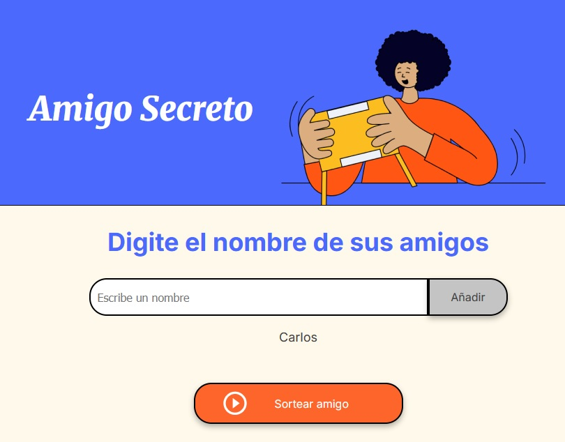
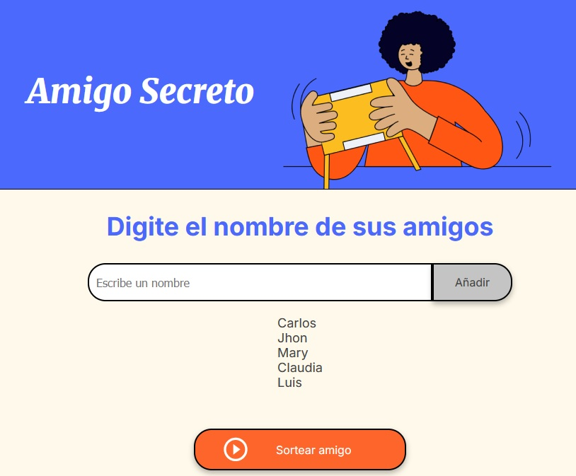
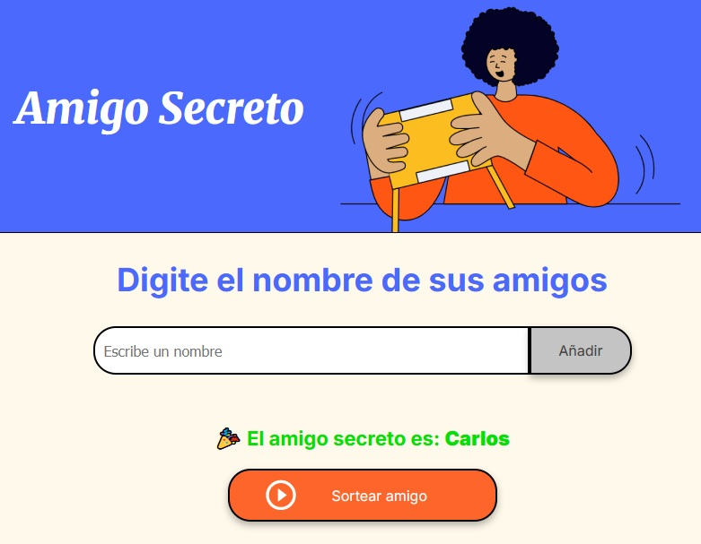
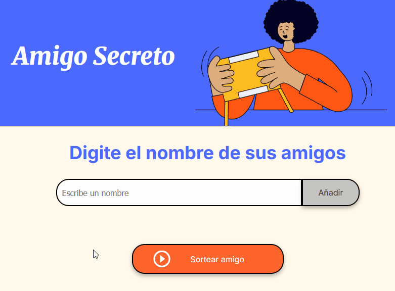

# 🎁 **Challenge Amigo Secreto**

Una aplicación divertida para organizar tu juego del **Amigo Secreto** de forma fácil, rápida y digital.  
Escribe los nombres de tus amigos, agrégalos a la lista y deja que la aplicación realice el sorteo por ti. 🎉

---

## 🚀 **Demo**

👉 [Prueba la aplicación aquí](https://victormanuelpc.github.io/challenge-amigo-secreto/)  






---

## ✨ **Características**

- Agregar nombres de amigos dinámicamente a una lista.
- Visualizar todos los amigos registrados en tiempo real.
- Realizar el sorteo del Amigo Secreto con un solo clic.
- Interfaz simple, intuitiva y responsive.

---

## 🛠️ **Tecnologías utilizadas**

- **HTML5** para la estructura.  
- **CSS3** para el estilo.  
- **JavaScript (DOM)** para la lógica de interacción.  

---

## 📦 **Instalación y uso**

1. Clona este repositorio:
   ```bash
   git clone https://github.com/victormanuelpc/challenge-amigo-secreto.git
2. Abre el archivo index.html en tu navegador.
3. ¡Listo! Ya puedes empezar a jugar con tus amigos. 🎉

---

## 🤝 **Contribuciones**

¿Tienes ideas para mejorar el proyecto? ¡Eres bienvenido!
1. Haz un fork del repositorio.
2. Crea una rama nueva: git checkout -b feature-nueva
3. Realiza tus cambios y haz commit: git commit -m "Descripción de la mejora"
4. Haz push a tu rama: git push origin feature-nueva
5. Abre un Pull Request.

---

## 👨‍💻 **Autor**

* Víctor Manuel
* GitHub: victormanuelpc
* LinkedIn: www.linkedin.com/in/victormanuelpc

---

⭐ **Si te gustó este proyecto, no dudes en dejar una estrella en el repositorio.**

